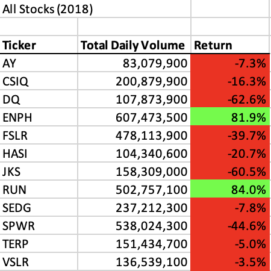

# VBA of Wall Street

## Overview of Project

### Purpose
The purpose of this analysis isn't necessarily to show Steve any new analyses, but rather to show him the power of refactoring code in order to make the program run efficiently. If Steve wants to use much larger datasets in the future, the new code will perform far better.

## Results

### Looking at the Stocks




### Looking at Legacy Code
There are two big differences in how the legacy code and refactored code operate. The first is how we define three key variables. See below.

```vba
Dim startingPrice As Double
Dim endingPrice As Double
Dim RowCount As Integer
```

These variables are pretty straightforward in that the `startingPrice` and `endingPrice` are both decimals along with the `rowCount` simply containing the number of rows, which will help with the `for` loops.

The second big difference is how the two `for` loops are situated. In the legacy code, the second loop in nested in the first loop. See below.

```vba
For i = 0 To 11
  ticker = tickers(i)
  totalVolume = 0
  '5) Loop through rows in the data
  Sheets(yearValue).Activate
  For j = 2 To RowCount
  ...
```

The second loop being nested within the first loop means it will run 12 total times. One loop for each ticker and there are a total of 3,012 rows not including the header row. Since that loop has to run 12 times, this program will ultimately run through 36,144 rows of data.

    Overview of Project
        The purpose and background are well defined (2 pt).
    Results
        The analysis is well described with screenshots and code (4 pt).
    Summary
        There is a detailed statement on the advantages and disadvantages of refactoring code in general (3 pt).
        There is a detailed statement on the advantages and disadvantages of the original and refactored VBA script (3 pt).
