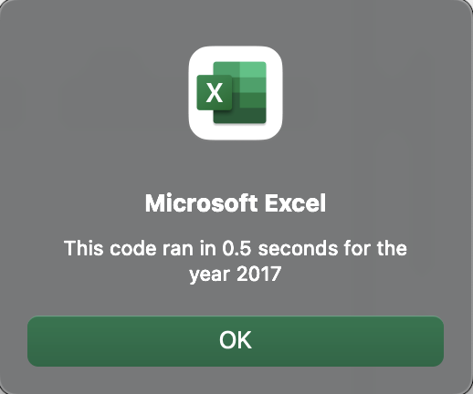

# VBA of Wall Street

## Overview of Project

### Purpose
The purpose of this analysis isn't necessarily to show Steve any new analyses, but rather to show him the power of refactoring code in order to make the program run efficiently. If Steve wants to use much larger datasets in the future, the new code will perform far better.

## Results

### Looking at the Stocks
Let's take a quick look at the results of our analysis. One can see that 2017 was a much better year for these particular stocks.


Meanwhile, in 2018, ENPH and RUN had substancial gains in their total daily volume as well as return, but every other ticker struggled in their returns despite most seeing a gain in their total daily volume.

### Looking at Legacy Code
There are two big differences in how the legacy code and refactored code operate. The first is how we define three key variables. See below.

```vba
Dim startingPrice As Double
Dim endingPrice As Double
Dim RowCount As Integer
```

These variables are pretty straightforward in that the `startingPrice` and `endingPrice` are both decimal numbers along with the `rowCount` simply containing the number of rows, which will help with the `for` loops.

The second big difference is how the two `for` loops are situated. In the legacy code, the second loop in nested in the first loop. See below.

```vba
For i = 0 To 11
  ticker = tickers(i)
  totalVolume = 0
  '5) Loop through rows in the data
  Sheets(yearValue).Activate
  For j = 2 To RowCount
  ...
```

The second loop being nested within the first loop means it will run 12 total times. One loop for each ticker and there are a total of 3,012 rows not including the header row. Since that loop has to run 12 times, this program will ultimately run through 36,144 rows of data. See below for a look at the program execution times for both 2017 and 2018 analyses.




It's quite clear to see that the run time for both analyses is the same. They both finished in 0.5 seconds. Now, let's take a look at the refactored code to see how it compares.

### Looking at Refactored Code
The three variables mentioned earlier are defined a bit differently here. See below.
```vba
Dim tickerVolumes(12) As Long
Dim tickerStartingPrices(12) As Single
Dim tickerEndingPrices(12) As Single
```

One can see that there is actually a new variable. The `rowCount` variable didn't go away, it was just defined earlier in the code and isn't needed for this example. It's clear that each variable is an array with a length of 12, the amount of tickers present. The total volume, starting price, and ending price will be entered into the arrays for each ticker.

Next, the `for` loops are slightly different. See below.

```vba
For i = 0 To 11
  tickerVolumes(i) = 0
Next i
        
''2b) Loop over all the rows in the spreadsheet.
For i = 2 To RowCount
...
```

The `Next i` is a clear indicator that the first `for` loop only contains a line of code that propogates the `tickerVolumes` array with zeros. The second loop, since it isn't nested within the first, won't be running 12 times. Instead, it will run through the 3,012 rows once and by the end have all the data that's needed. This can be done because the arrays are used. Let's look at the execution times for the refactored code.


As one can see, the refactored code ran an almost full 0.4 seconds quicker. If the dataset were far larger, the time savings too would be far larger. Also, take note that the run time for the refactored code includes the time it takes to format the data as well, whereas the run time for the legacy code is only for the calculation and display of data.

## Summary
### Advantages and Disadvantages of Legacy and Refactored Code
In summary, there can be some incredible advantages to refactoring code. Readability, scalability, efficiecy, and much more can be improved upon by refactoring code. But, there is one big drawback: time. It takes a good deal of time to dredge up legacy code, make sense of what the code is doing, decide whether or not it's worth refactoring, then figuring out the logistics of having the code refactored. All of that takes time and consequensly for many people and companies more money as well. So, for those that don't have the time or budget to refactor their code, legacy code will simply have to suffice.

### Advantages and Disadvantages of the Two VBA Scripts
Lastly, when comparing the two scripts, two big points are brought to light and the scripts oppose one another with their advantage and disadvantage. An advantage to the legacy code is that it is quite straightforward and simple to read. This is in part to having split up certain functions into their own scripts such as prompting the year and formatting the table data. The glaring disadvantage is the performance when compared with the refactored code. Meanwhile, the advantage of the refactored code is its performance, but its disadvantage is its overall readability. Refactoring may lead to a more clever solution, but it can certainly make it much more difficult to look back on and quickly understand what the code is doing.
